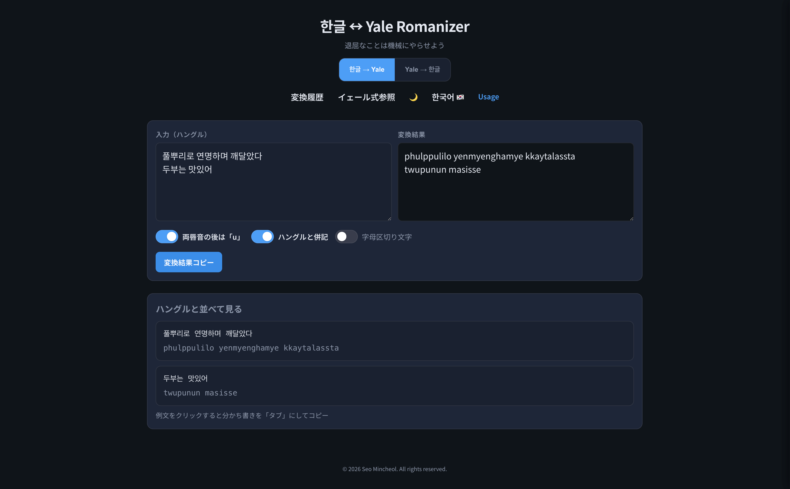

# Hangul → Yale Romanization

  

## 概要

ハングルをイェール式ローマ字(Yale Romanization)に変換します。

主な機能:
- 入力したハングルをイェール式ローマ字に自動変換
- 原文（ハングル）とイェール式ローマ字を上下に並べて表示
- 変換履歴を`localStorage`に最大10個まで保存
- ハングル字母とそれに対応するイェール式表記を参照可能
- 字母区切り文字を挿入可能
---

## 使い方
- インターネットに接続可能な環境では[ウェブアプリケーション](https://hangul-yale-romanizer.netlify.app/)に接続

- インターネットに接続できない環境では、ファイルをローカルにダウンロードし、`index.html`を開くことですぐに利用可能

---

## コピー機能
- 「変換結果コピー」ボタンを押すと、「変換結果」に表示されている内容を、半角空白の代わりに「タブ」を挿入してコピーします。
- 半角空白を保持したままコピーをするには、「変換結果」にある内容をドラッグ＆ドロップすることで、コピーできます。
- 「ハングルと並べて見る」に表示されている内容は、例文をクリックすることで、「タブ」を挿入してコピーします。

---

## スクリーンショット

  

 
---

## ライセンス
- MIT License

このプロジェクトは、MITライセンスで公開されている以下のプロジェクトを参考にしています:

- [asaokitan/hangul2yale](https://github.com/asaokitan/hangul2yale)
- [stannam/hangul_to_ipa](https://github.com/stannam/hangul_to_ipa)
---