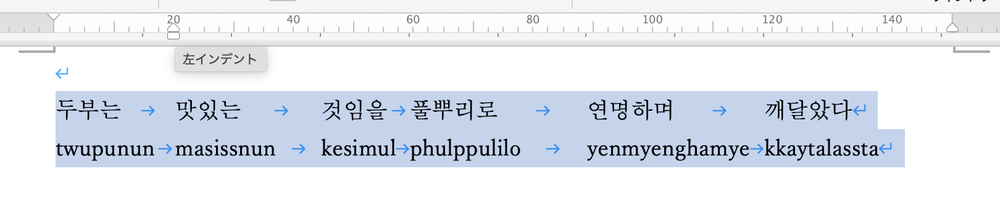
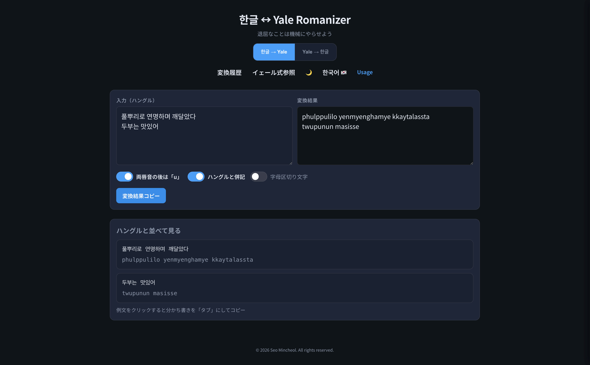

# Hangul ↔ Yale Romanizer

  

## 概要

ハングルとイェール式ローマ字(Yale Romanization)を相互に変換します。

主な機能:
- 入力したハングルをイェール式ローマ字に自動変換
- イェール式ローマ字からハングルへの逆変換（ビームサーチDPによる確率的変換）
- 原文（ハングル）とイェール式ローマ字を上下に並べて表示
- 変換履歴を`localStorage`に最大10個まで保存
- 字母区切り文字を挿入可能
- ハングル字母とそれに対応するイェール式表記を参照可能

---

## 使い方
- インターネットに接続可能な環境では[ウェブアプリケーション](https://hangul-yale-romanizer.netlify.app/)に接続

- インターネットに接続できない環境では、ファイルをローカルにダウンロードし、`index.html`を開くことですぐに利用可能
  - ただし、Yale→ハングル変換には頻度データの読み込みが必要なため、ローカルサーバー（例: `python3 -m http.server 8080`）経由での利用を推奨します。

---

## Yale → ハングル変換について

### 曖昧性の問題

イェール式ローマ字は、一つのローマ字列が複数のハングル音節列に対応する場合があります。例えば `cenel` は「저널」にも「전얼」にも解釈できます。この曖昧性を解消するため、本ツールでは統計的手法を用いています。

### 変換アルゴリズム

1. 入力されたYale文字列を `.` や `-` で区切り、各セグメントに対して可能な音節分割をすべて列挙します（DAGグラフの構築）。
2. **ビームサーチDP**（ビーム幅 K=5）により、以下のスコアを組み合わせて最適な音節列を選択します:
   - **ユニグラムスコア**: 各音節の出現頻度
   - **バイグラムスコア**: 隣接する音節ペアの共起頻度
   - **単語ボーナス**: 辞書に登録された2〜6音節の単語に対する追加スコア

### 精度と限界

変換精度はコーパスのカバレッジに依存します。以下のような場合、誤変換が生じる可能性があります:

- コーパスに含まれない低頻度語（例: 専門用語、外来語）
- バイグラム・単語辞書のいずれにも登録されていない語の組み合わせ

誤変換が生じた場合は、`.` や `-` を入力して音節境界を明示することで、正しい変換結果を得ることができます（例: `ce.nel` → 저널）。

---

## コピー機能
- 「変換結果コピー」ボタンを押すと、「変換結果」に表示されている内容を、半角空白の代わりに「タブ」を挿入してコピーします。
- 半角空白を保持したままコピーをするには、「変換結果」にある内容をドラッグ＆ドロップすることで、コピーできます。
- 「ハングルと並べて見る」に表示されている内容は、例文をクリックすると、「タブ」を挿入してコピーします。

「半角空白」の代わりに「タブ」を挿入している理由は、Wordなどで[グロス](https://ja.wikipedia.org/wiki/%E3%82%B0%E3%83%AD%E3%82%B9_(%E8%A8%80%E8%AA%9E%E5%AD%A6))を付けるときに、複数行の調整が便利だからです。

  

---

## スクリーンショット

  

---

## データソース

Yale→ハングル変換の頻度データ (`data/syllable-freq.json`) は、以下のデータから生成されています:

- **[Hermit Dave / FrequencyWords](https://github.com/hermitdave/FrequencyWords)** by Hermit Dave
  - コンテンツライセンス: [CC BY-SA 4.0](https://creativecommons.org/licenses/by-sa/4.0/)
  - データソース: [OpenSubtitles](https://www.opensubtitles.org/) 2018 Korean corpus (`ko_*.txt` 파일 기반)

頻度データには、ユニグラム（音節頻度）、バイグラム（音節ペア頻度）、および単語頻度（2〜6音節）が含まれています。

---

## 参考プロジェクト

このプロジェクトは、MIT licenseで公開されている以下のプロジェクトを参考にしています:

- **[asaokitan / hangul2yale](https://github.com/asaokitan/hangul2yale)** by 淺尾 仁彦
- **[stannam / hangul_to_ipa](https://github.com/stannam/hangul_to_ipa)** by Stanley Nam
---