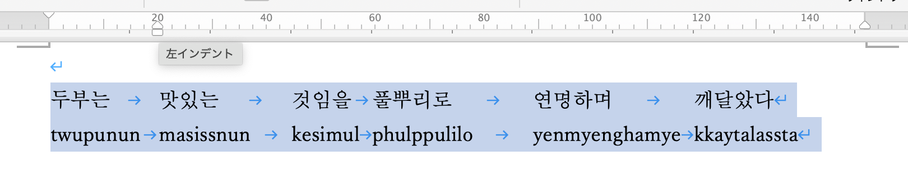
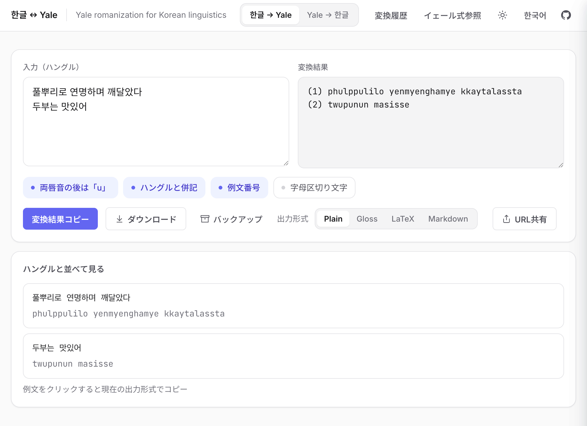

# Hangul ↔ Yale Romanizer
<p align="center">
  
</p>

## 概要

ハングルとイェール式ローマ字(Yale Romanization)を相互に変換します。

主な機能:
- 入力したハングルをイェール式ローマ字に自動変換
- イェール式ローマ字からハングルへの逆変換（ビームサーチDPによる確率的変換）
- 曖昧性のあるYale語は単語クリックで候補を切り替え可能
- 原文（ハングル）とローマ字を上下に並べて表示
- グロス編集: 語ごとに形態素注釈を入力し、Leipzig形式の3行グロス（原文／ローマ字／注釈）を作成
- 3種類の出力形式（Plain / LaTeX / Markdown）と例文番号付与
- ファイルのドラッグ＆ドロップ／結果のダウンロード／URL共有／全状態のバックアップ
- 変換履歴を`localStorage`に最大50件まで保存（検索・タグ付け対応）
- 字母区切り文字を挿入可能
- ハングル字母とそれに対応するイェール式表記を参照可能
- コピー時のタブ区切り／半角空白の切り替え（Wordでのグロス作成用）
- ダークモード／UI言語切り替え（日本語・韓国語）

---

## 使い方
- インターネットに接続可能な環境では[ウェブアプリケーション](https://hangul-yale-romanizer.netlify.app/)に接続

- ローカルで動かす場合はリポジトリをクローンし、開発サーバーを起動してください（Node 22 推奨）:
  ```bash
  npm install
  npm run dev
  ```
  ブラウザで http://localhost:5173 にアクセス。

- 本番ビルド:
  ```bash
  npm run build    # dist/ に出力
  npm run preview  # ビルド結果の確認
  ```

---

## 開発

### 技術スタック

- **UI**: React 19 + TypeScript + Tailwind CSS v4 + shadcn/ui（Vite ビルド）
- **変換エンジン**: 依存パッケージなしの純粋な ES Modules（`src/converter/`）— UIフレームワークに依存せず、単体でテスト可能

### テスト

変換ロジックの単体テストを Node 標準の test runner で実行できます。

```bash
npm test
# または
node --test tests/
```

### 型チェック

```bash
npm run typecheck
```

---

## グロス編集

「グロス編集」スイッチをONにすると、「ハングルと並べて見る」の各語の下に注釈欄が表示され、形態素グロスを直接入力できます。入力したグロスは [Leipzig Glossing Rules](https://www.eva.mpg.de/lingua/resources/glossing-rules.php) 形式の3行グロス（原文／ローマ字／注釈）として全出力形式に反映されます:

- **Plain**: 原文／ローマ字／注釈の3行ブロックで出力（「タブ区切り」ONなら語間がタブに置換され、そのままWord等に貼り付け可能）
- **LaTeX**: `\gll` の代わりに `\glll` を使用（未入力の語は `{}`）
- **Markdown**: 表に注釈行を追加

グロスが未入力の場合、出力は従来と完全に同一です。グロスは行のテキストに紐付くため、該当行を編集すると注釈はリセットされます（他の行は保持）。URL共有・バックアップにも含まれます。

---

## Yale → ハングル変換について

### 曖昧性の問題

イェール式ローマ字は、一つのローマ字列が複数のハングル音節列に対応する場合があります。例えば `cenel` は「저널」にも「전얼」にも解釈できます。この曖昧性を解消するため、本ツールでは統計的手法を用いています。

### 変換アルゴリズム

1. 入力されたYale文字列を `.` や `-` で区切り、各セグメントに対して可能な音節分割をすべて列挙します（DAGグラフの構築）。
2. **ビームサーチDP**（ビーム幅 K=5）により、以下のスコアを組み合わせて最適な音節列を選択します:
   - **ユニグラムスコア**: 各音節の出現頻度
   - **バイグラムスコア**: 隣接する音節ペアの共起頻度
   - **単語ボーナス**: 辞書に登録された2〜6音節の単語に対する追加スコア

### 精度と限界

変換精度はコーパスのカバレッジに依存します。以下のような場合、誤変換が生じる可能性があります:

- コーパスに含まれない低頻度語（例: 専門用語、外来語）
- バイグラム・単語辞書のいずれにも登録されていない語の組み合わせ

誤変換が生じた場合の対処方法は2つあります:

1. **単語クリックで候補切り替え** — Yale→ハングル変換時、曖昧性のある語には点線下線が表示されます。クリックすると上位候補（最大5件）がポップアップで表示され、別の解釈に切り替えられます。選択は出力テキストエリア・ダウンロード・URL共有すべてに反映されます。
2. **音節境界を明示** — `.` や `-` を入力して区切ると、確率モデルを介さず決定論的に変換します（例: `ce.nel` → 저널）。なお、語末の `.` は境界ではなく文末の句読点として扱われ、変換結果にそのまま保持されます。

---

## 出力形式

論文・ドキュメントへの貼り付けを想定した3種類の出力形式に対応しています。出力形式は変換結果コピーボタンの右側のチップで切り替え可能です（選択は次回起動時にも保持）。

### Plain
素のテキスト出力。「タブ区切り」スイッチ（デフォルト ON）が ON のとき、コピー時に半角空白がタブに置換されます（Wordでのグロス作成用）。「例文番号」スイッチをONにすると各行の先頭に `(1) (2) (3)…` が付きます。原文と並べた出力が必要な場合は「グロス編集」をONにしてください。

### LaTeX (`gb4e` 形式)
言語学論文で標準的に使われる `gb4e` パッケージの構文で出力します。`\trans` 行は空欄なので訳文を後から挿入してください。

```latex
\begin{exe}
\ex
\gll 한국어를 공부 한다 \\
     hankwukelul kongpu hanta \\
\trans `'
\end{exe}
```

### Markdown 表
GitHub・Notion・Obsidian にそのまま貼り付け可能な表形式。例文ごとに表を分割します（語数が異なる例文を1つの表に合わせるとカラム数が合わないため）。

```markdown
| 한국어를 | 공부 | 한다 |
|---|---|---|
| hankwukelul | kongpu | hanta |
```

---

## ファイル入出力・URL共有

### ファイルのドラッグ＆ドロップ
入力欄に `.txt` / `.csv` / `.tsv` / `.md` などのテキストファイルをドラッグ＆ドロップすると、内容が自動的に読み込まれます（5MB制限）。コーパスや例文集など大量テキストの一括変換に便利です。

### 結果のダウンロード
「ダウンロード」ボタンで現在の出力をファイルとして保存できます。出力形式に応じて拡張子・MIMEタイプが自動的に決まります:

| 出力形式 | 拡張子 | MIME |
|---|---|---|
| Plain    | `.txt` | `text/plain` |
| LaTeX    | `.tex` | `application/x-tex` |
| Markdown | `.md`  | `text/markdown` |

ファイル名は `yale-{方向}-{タイムスタンプ}.{拡張子}` 形式で生成されます（例: `yale-h2y-2026-05-02T09-30-00.tex`）。

### URL共有
「URL共有」ボタンを押すと、現在の入力テキスト・全オプション（変換方向・両唇音・区切り文字・併記・出力形式・例文番号）・単語クリックで切り替えた候補選択・グロス注釈をURLにエンコードしてクリップボードにコピーします。共同研究者にこのURLを送れば、同じ画面が再現されます。旧バージョンで生成した共有URLもそのまま開けます。

URLパラメータがある場合は、ブラウザの`localStorage`設定よりも優先して適用されます。

### バックアップ
「バックアップ」ボタンで、入力・出力・全オプション・候補選択・グロス注釈をひとつのJSONファイルにまとめて保存できます。ファイル内の `shareUrl` をブラウザで開けば、保存時の画面をそのまま再現できます。

---

## 履歴

変換結果は自動的に`localStorage`に保存されます（最大50件）。「変換履歴」ドロワーから:

- **検索** — 入力ボックスに文字列を入れると、該当する履歴のみフィルタリング
- **タグ** — 各項目に任意のタグを付けて分類。タグ一覧から絞り込み可能
- **ピン留め** — よく使う履歴を上部に固定

---

## コピー機能
- 「タブ区切り」スイッチ（デフォルト ON）が ON のとき、Plain 形式のコピーは半角空白を「タブ」に置換します。OFF にすると半角空白のまま コピーされます（設定は次回起動時にも保持）。
- この設定は3つのコピー経路すべてに適用されます: 「変換結果コピー」ボタン／「変換結果」内のテキスト選択（自動コピー）／「ハングルと並べて見る」の例文クリック。
- LaTeX・Markdown 形式はそれぞれの構文を壊さないよう、常にそのままコピーされます。

「半角空白」の代わりに「タブ」を挿入している理由は、Wordなどで[グロス](https://ja.wikipedia.org/wiki/%E3%82%B0%E3%83%AD%E3%82%B9_(%E8%A8%80%E8%AA%9E%E5%AD%A6))を付けるときに、複数行の調整が便利だからです。

<p align="center">
  
</p>

---

## スクリーンショット
<p align="center">
  
</p>

---

## データソース

Yale→ハングル変換の頻度データ (`data/syllable-freq.json`) は、以下のデータから生成されています:

- **[Hermit Dave / FrequencyWords](https://github.com/hermitdave/FrequencyWords)** by Hermit Dave
  - コンテンツライセンス: [CC BY-SA 4.0](https://creativecommons.org/licenses/by-sa/4.0/)
  - データソース: [OpenSubtitles](https://www.opensubtitles.org/) 2018 Korean corpus（`ko_*.txt` ファイルに基づく）

頻度データには、ユニグラム（音節頻度）、バイグラム（音節ペア頻度）、および単語頻度（2〜6音節）が含まれています。

---

## 参考プロジェクト

このプロジェクトは、MIT licenseで公開されている以下のプロジェクトを参考にしています:

- **[asaokitan / hangul2yale](https://github.com/asaokitan/hangul2yale)** by 淺尾 仁彦
- **[stannam / hangul_to_ipa](https://github.com/stannam/hangul_to_ipa)** by Stanley Nam
---